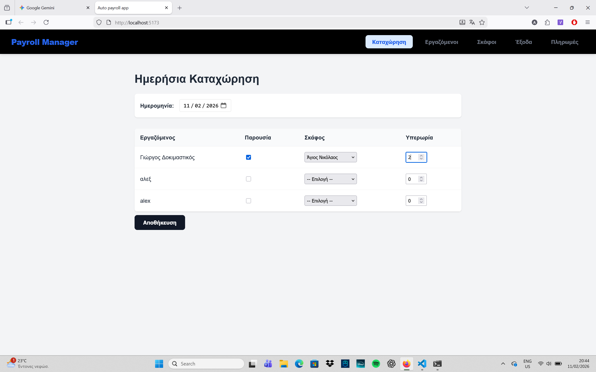
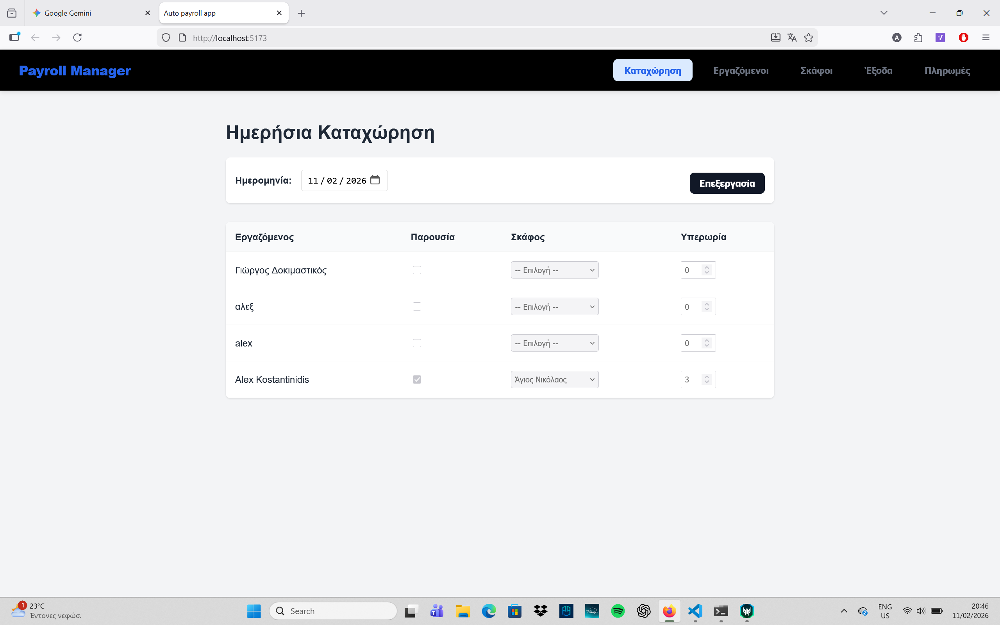
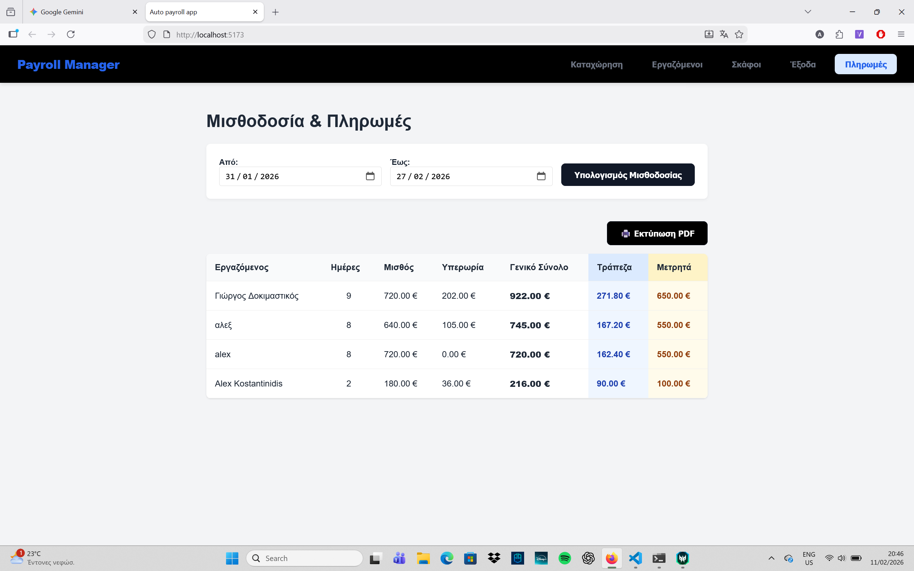
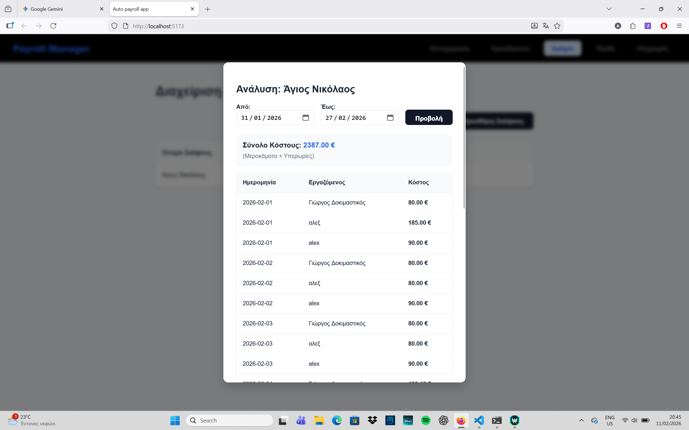
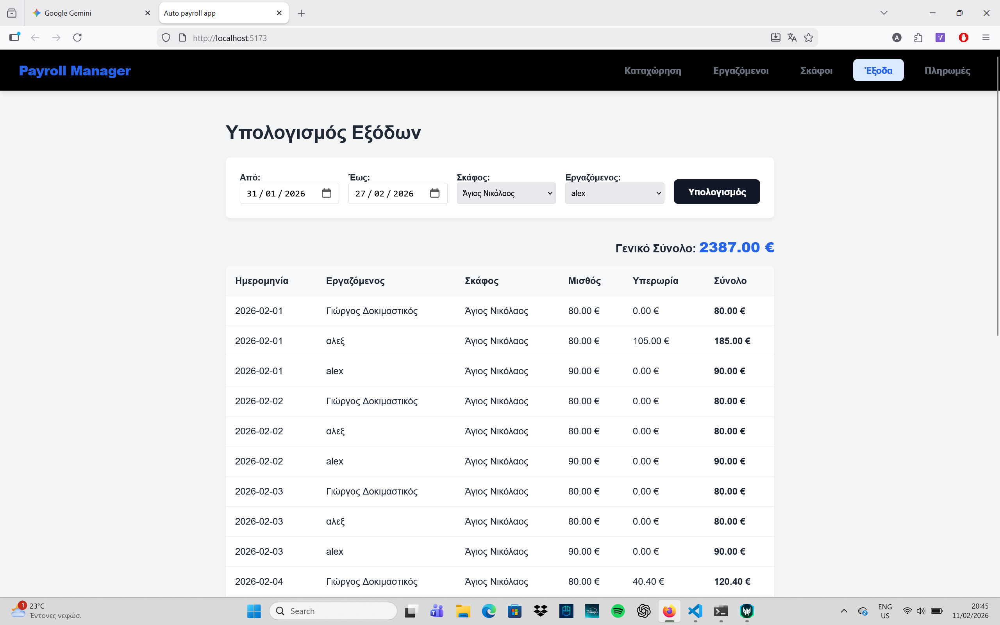
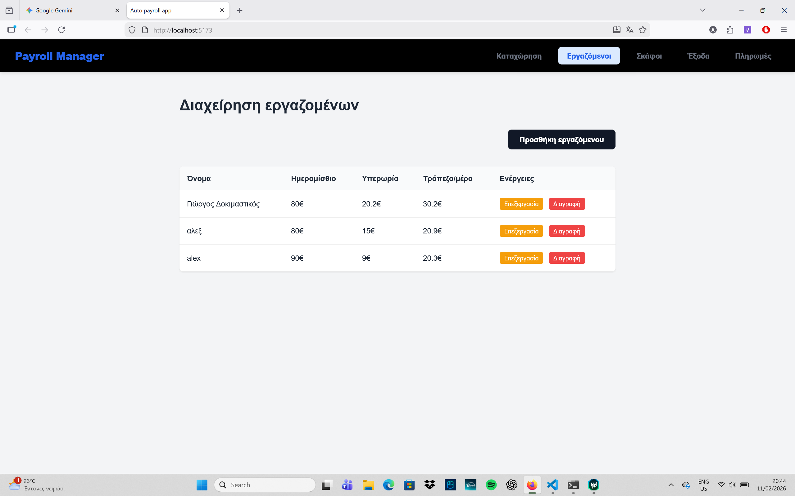
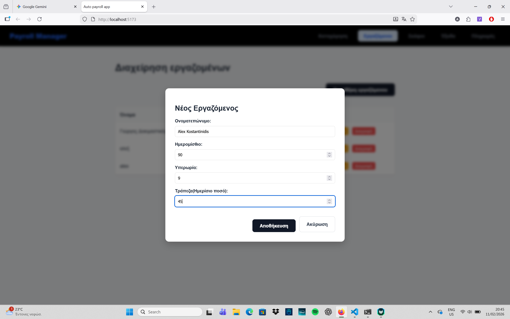
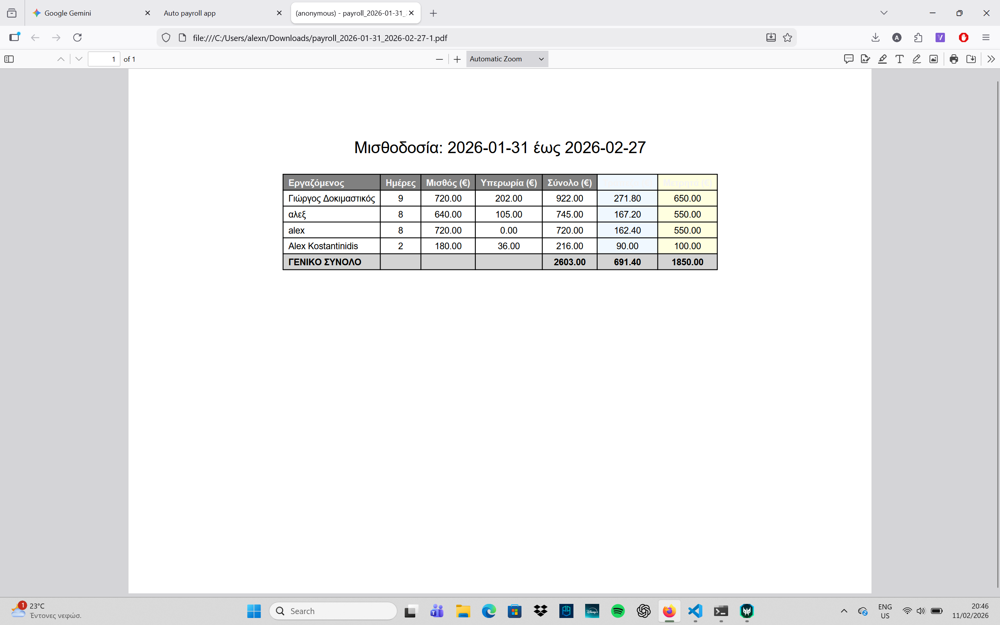

# Payroll Manager & Maritime Resource System

A full-stack web application designed to manage daily attendance, calculate complex payrolls, and track operational costs for maritime personnel and boats.

Built with **FastAPI (Python)** and **TypeScript**, focusing on strict financial logic and automated reporting.

## Features

### 1. Daily Attendance Tracking
- Log daily presence for employees.
- Assign employees to specific boats.
- Input overtime hours per day.
- **Smart Validation:** Prevents saving incomplete records.

### 2. Employee & Boat Management
- **Employees:** Manage profiles, daily wages, overtime rates, and bank transfer limits.
- **Boats:** Track fleet inventory and manage active vessels.

### 3. Advanced Payroll Algorithm
- **Automated Calculation:** Computes total wage + overtime cost based on attendance.
- **Cash/Bank Split Logic:** Implements a custom "50€ Rule":
  - Automatically calculates the bank transfer amount based on daily limits.
  - The remaining amount is paid in cash, **rounded down to the nearest 50€**.
  - Any remainder from the cash rounding is added back to the bank transfer.

### 4. Cost Analysis & Reporting
- **Boat Analysis:** View total operational costs per boat for any date range.
- **Expense Report:** General overview of all labor costs.
- **PDF Export:** Generates official payroll slips in Greek (supporting unicode fonts) ready for printing.

---

## Tech Stack

### Backend
- **Python 3.x**
- **FastAPI:** High-performance web framework for building APIs.
- **SQLAlchemy:** ORM for database interactions.
- **SQLite:** Lightweight relational database.
- **ReportLab:** Library for programmatic PDF generation.

### Frontend
- **TypeScript:** For type-safe logic and DOM manipulation.
- **Vite:** Next Generation Frontend Tooling.
- **HTML5 / CSS3:** Custom responsive design with animations.

---

## Installation & Setup

### Prerequisites
- Python 3.8+
- Node.js & npm

### Clone the Repository
```bash
git clone [https://github.com/yourusername/payroll-manager.git](https://github.com/yourusername/payroll-manager.git)
cd payroll-manager

### Create the virtual enviroment
cd backend
python -m venv venv
# Activate venv:
# Windows:
.\venv\Scripts\activate
# Mac/Linux:
# source venv/bin/activate

### Install Python dependencies
pip install requirements.txt

### Install frontend dependencies 
cd ../frontend
npm install


## How to run
Simply double-click the start_app.bat file in the root directory. This script automatically:

Starts the Backend server.

Starts the Frontend server.

Opens the application in your default browser.

### Option B
Terminal 1:
cd backend
uvicorn app.main:app --reload

Terminal 2:
cd frontend
npm run dev

### Screenshots 
### Daily Entry Page



### Payroll Calculation & 50€ Rule


### Cost Analysis throught dates and workers



### Add and edit worker tabs

### Payroll Calculation & 50€ Rule


### PDF export
