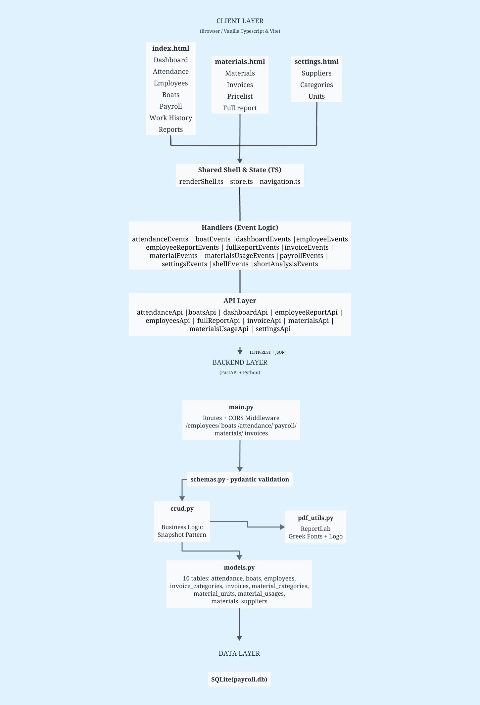
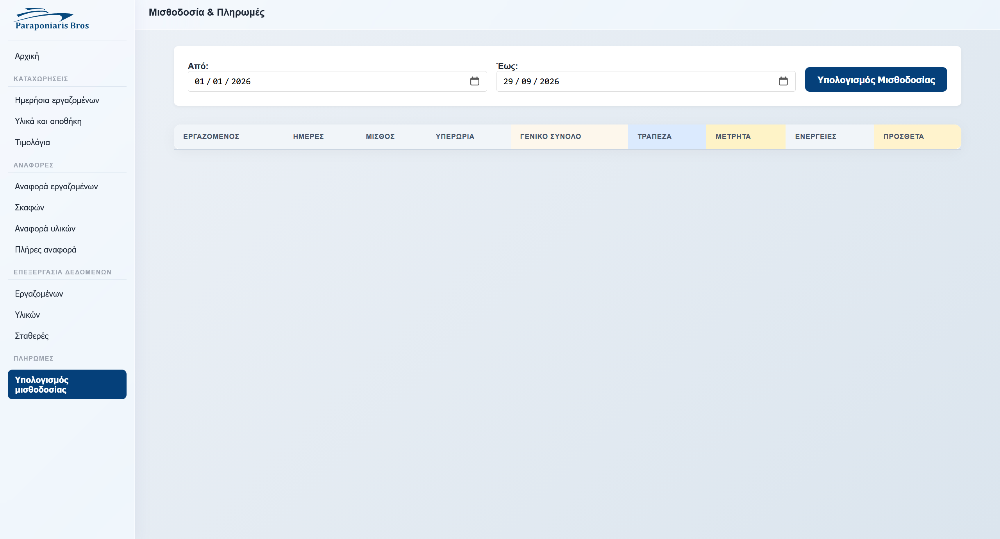
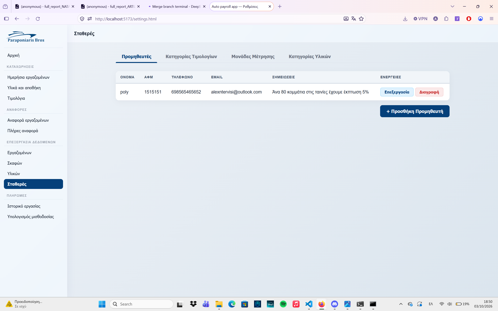
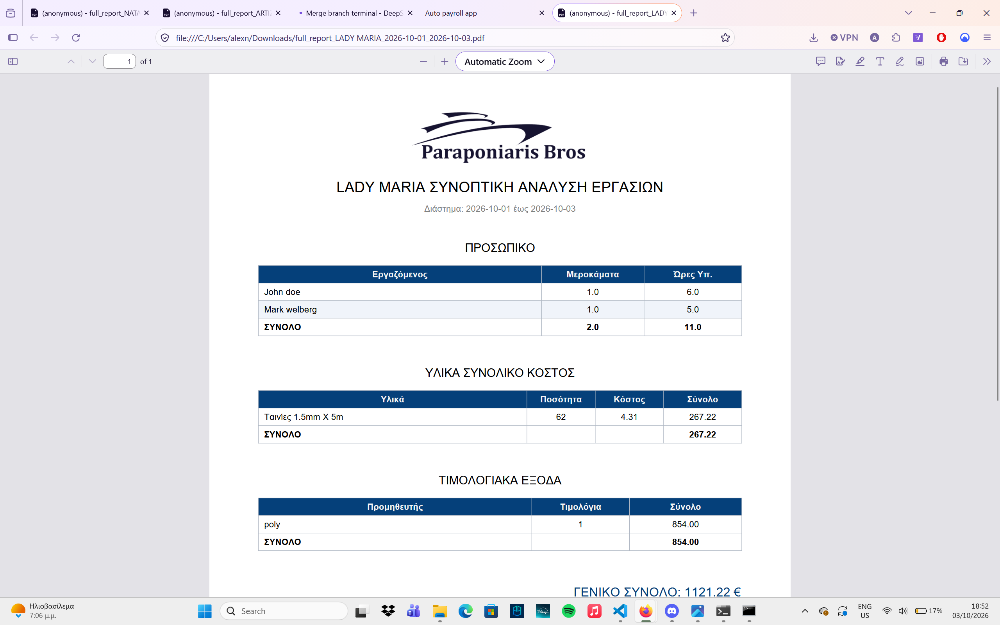

# ERP system for a ship repair company

# Boat Repair ERP

A full-stack ERP system built for a Greek boat repair company, replacing a fully manual, paper-based workflow with a modern web application for payroll, attendance, materials, and invoicing.


---

## Impact

After deployment, the system produced measurable results in the first months of use:

| Metric | Before | After | Improvement |
|---|---|---|---|
| **Payroll errors per month** | ~20 | ~2 | **90% reduction** |
| **Payroll calculation time** | 2 full days | 1 click | **~99% faster** |
| **Payment frequency** | Every 30 days | Every 15 days | **2x faster payouts** |

The system started with payroll — the client's biggest pain point — and was validated in real production payrolls before expanding to materials, invoices, and reporting.

---

## The Problem

The client was running a boat repair company with a **fully manual workflow** — no Excel, no software, just paper and hand calculations. This created:

- **Frequent payroll errors** — roughly 20 miscalculations per month
- **Slow monthly close** — payroll took up to **2 full days** of manual calculation
- **Cash flow pressure on workers** — 30-day payment cycles caused financial strain
- **Lost history** — when wage rates changed, there was no way to audit past payrolls
- **Data silos** — attendance, materials, and invoices were tracked separately, if at all
- **No cost visibility per boat** — impossible to know which jobs were profitable

## The Solution

A centralized web application that digitized the entire operation:

- Tracks **daily attendance** with overtime and multi-boat allocation
- Calculates **monthly payroll** automatically (with bank/cash split) — now in **one click**
- Records **material usage** per boat with automatic aggregation
- Manages **supplier invoices** linked to specific boats
- Generates **PDF reports** for payroll, materials, invoices, and full boat cost analysis
- Preserves **historical integrity** through a snapshot pattern — every attendance record stores the wage rates that were active at the time

The shorter calculation cycle enabled **bi-weekly payouts** instead of monthly — a significant quality-of-life improvement for the client's workers.

---

## Features

### Core
- **Daily attendance tracking** — full day / half day / absent / overtime hours
- **Multi-boat overtime** — an employee can work on a different boat during overtime
- **Snapshot pattern** — historical wage integrity for every record
- **Payroll calculation** — automatic bank/cash split with capped bank days
- **Materials per boat** — consumption tracking with auto-aggregation
- **Invoice management** — suppliers linked to boats
- **PDF exports** — 6 different report types with navy branding and Greek fonts

### Extras
- **Dashboard** — monthly KPIs, daily trend chart, top 5 boats by YTD spending
- **Reports** — attendance, materials, invoices, payroll, boat cost analysis
- **Settings** — configurable suppliers, categories, and units

---

## Tech Stack

| Layer | Technology |
|---|---|
| **Frontend** | Vanilla TypeScript + Vite |
| **Charts** | Chart.js |
| **Backend** | FastAPI + SQLAlchemy |
| **Database** | SQLite |
| **PDF** | ReportLab |
| **Fonts** | Arial (Greek support) |

---

## Documentation
- [API Endpoints Reference](endpoints.md)

## Architect Diagram




## App screenshots

### Inventory/ Pricelist **Data are mocked just to visualize the UI, brand logo is real


### Payroll


### Manipulate standard data


## Data organized


## PDF Report 


---

## Local Setup

**Quick start:**

```bash
# Backend
cd backend
python -m venv venv
venv\Scripts\activate
pip install -r requirements.txt
uvicorn app.main:app --reload

# Frontend (in a new terminal)
cd frontend
npm install
npm run dev
```

Open `http://localhost:5173` in your browser.

---

## Project Status

**In production** at the client site. Actively maintained with new features in development:

- JWT authentication

*Built end-to-end: database schema, REST API, business logic, PDF generation, and frontend UI.*


